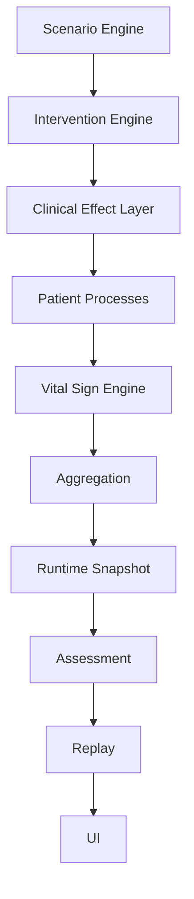
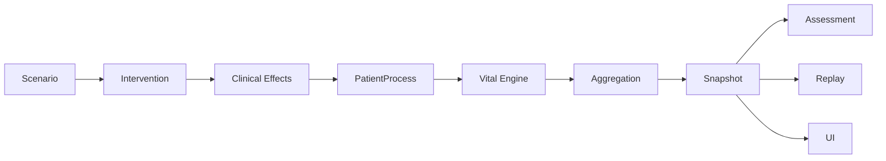

# RussiCaptor Architecture Freeze v0.6.0

Status: **FROZEN**  
Applies from: `v0.6.0-alpha`  
Scope: invariant architecture rules only

This document does not replace `ARCHITECTURE.md`. It defines the architectural
boundaries that future work packages and pull requests must preserve. Detailed
implementation descriptions remain in `ARCHITECTURE.md` and the individual WP
reports.

## Table of Contents

1. [Architecture Principles](#1-architecture-principles)
2. [Runtime Layers](#2-runtime-layers)
3. [Layer Responsibilities](#3-layer-responsibilities)
4. [Dependency Rules](#4-dependency-rules)
5. [Forbidden Dependencies](#5-forbidden-dependencies)
6. [Clinical Effect Contract](#6-clinical-effect-contract)
7. [Contributor Contract](#7-contributor-contract)
8. [Runtime Snapshot Contract](#8-runtime-snapshot-contract)
9. [Assessment Contract](#9-assessment-contract)
10. [Replay Contract](#10-replay-contract)
11. [Configuration Contract](#11-configuration-contract)
12. [Testing Contract](#12-testing-contract)
13. [Performance Contract](#13-performance-contract)
14. [Extensibility Rules](#14-extensibility-rules)
15. [Versioning Policy](#15-versioning-policy)
16. [Architectural Decision Records](#16-architectural-decision-records)
17. [Architecture Checklist](#17-architecture-checklist)

## 1. Architecture Principles

### Single Source of Truth

Each runtime fact has exactly one canonical owner. Projections, reports, and UI
models may derive information from the canonical state but may not become parallel
writable sources.

### Deterministic Runtime

The same configuration, fixture, ordered inputs, simulation clock, and seed must
produce identical state, events, effects, assessment, and hashes. Collection or
insertion order must never influence clinical results.

### Immutable Runtime Snapshots

Published runtime snapshots are immutable value objects. Consumers receive
serializable copies and may not retain mutable references to engine internals.

### Replay First

Every runtime feature is designed for replay before UI convenience. A feature is
not complete until its state transitions and outputs can be reproduced exactly.

### Configuration Before Code

Clinical thresholds, baselines, rates, limits, timings, and mappings belong in
validated configuration. Code implements generic mechanisms, not scenario-specific
values.

### Clinical Effects before Physiology

Interventions and medications emit abstract Clinical Effects. Eligible
PatientProcesses consume those effects and determine physiological consequences.
No intervention may bypass this boundary to change physiology or monitor values.

### Separation of Simulation and Assessment

Simulation produces facts. Assessment observes immutable facts and evaluates them.
Assessment never influences simulation decisions or runtime state.

### Read-only Presentation Layer

UI components and view models render snapshots and dispatch explicit user intent.
They do not calculate clinical outcomes, reserve resources, aggregate state, or
evaluate protocols.

### Data-driven Expansion

New diseases, protocols, interventions, and medications extend existing contracts
through configuration and registered domain components. Expansion must not create
parallel runtime architectures.

## 2. Runtime Layers

The following order is frozen. No future work package may reorder, bypass, merge,
or introduce another runtime layer into this chain.

The diagram describes architectural responsibility and data flow. Runtime snapshot
data may be read independently by Assessment, Replay, and UI, but none of those
consumers may write backwards into the runtime chain.

## 3. Layer Responsibilities

### Scenario Engine

Allowed:

- simulation clock and scheduling;
- deterministic tick orchestration;
- dispatching inputs to the responsible layer;
- collecting layer outputs and publishing completed snapshots.

Forbidden:

- disease or physiology algorithms;
- UI behavior;
- protocol assessment;
- direct vital-sign calculation.

### Intervention Engine

Allowed:

- validating intervention definitions and requests;
- deterministic conflict and priority resolution;
- reserving and releasing resources through ResourcePool;
- maintaining intervention lifecycle;
- creating configured Clinical Effects.

Forbidden:

- changing vital signs;
- changing PatientProcess state directly;
- disease-specific physiology;
- assessment decisions.

### Clinical Effect Layer

Allowed:

- expressing an abstract, typed clinical influence;
- validating and routing effects to eligible PatientProcesses;
- deterministic effect lifecycle and attribution.

Forbidden:

- monitor calculation;
- direct physiology or Runtime Snapshot mutation;
- resource allocation;
- protocol evaluation.

### Patient Processes

Allowed:

- configuration-driven disease progression;
- process-owned clinical and physiological state;
- consuming eligible Clinical Effects;
- emitting typed contributors, findings, alerts, and status proposals.

Forbidden:

- UI behavior;
- resource allocation;
- direct monitor or Runtime Snapshot writes;
- protocol assessment.

### Vital Sign Engine

Allowed:

- deterministic contributor resolution;
- baseline, limits, change-per-tick, trend, and rounding application;
- monitor synthesis and derived vital calculations;
- vital, trend, and monitor-quality events.

Forbidden:

- disease algorithms;
- medication pharmacology;
- intervention or resource decisions;
- assessment rules.

### Aggregation

Allowed:

- ownership enforcement;
- deterministic conflict resolution;
- combining accepted outputs into canonical runtime fields;
- producing a complete candidate Runtime Snapshot.

Forbidden:

- disease-specific progression;
- UI projection logic;
- protocol assessment;
- bypassing ownership rules.

### Runtime Snapshot

Allowed:

- immutable, complete, serializable runtime representation;
- read-only consumption by Assessment, Replay, adapters, and UI.

Forbidden:

- behavior, lazy calculations, callbacks, or mutable engine references.

### Assessment Engine

Allowed:

- deterministic rule evaluation from snapshots and logs;
- findings, strengths, warnings, failures, and debrief generation;
- protocol-independent rule execution.

Forbidden:

- any Runtime mutation;
- intervention or resource execution;
- disease progression;
- UI business logic.

### Replay

Allowed:

- reconstructing runtime exclusively from canonical configuration and inputs;
- canonical serialization, comparison, and hashing;
- detecting nondeterminism.

Forbidden:

- mutable shared state;
- hidden inputs such as wall-clock time or collection insertion order;
- repairing or normalizing an incorrect result after execution.

### UI

Allowed:

- rendering read-only projections;
- collecting user input;
- dispatching explicit commands through public services.

Forbidden:

- clinical or protocol business logic;
- resource reservation;
- physiology or vital calculations;
- direct Runtime mutation.

## 4. Dependency Rules

Dependencies flow in one direction only:

Rules:

- a layer may depend only on stable contracts from itself or an upstream source;
- downstream consumers may receive immutable values, never internal references;
- reverse dependencies and callback-based backchannels are forbidden;
- orchestration does not grant Scenario Engine ownership of domain logic;
- shared models must remain data contracts and may not contain layer behavior.

## 5. Forbidden Dependencies

| Source | Forbidden dependency or action | Reason |
|---|---|---|
| Assessment | Runtime writes | Evaluation must not alter the simulation it evaluates. |
| UI | Resource reservation or direct engine mutation | Presentation is read-only and commands use public services. |
| Vital Sign Engine | Disease algorithms | Processes own disease progression. |
| Vital Sign Engine | Medication algorithms | Medication emits effects or contributors through contracts. |
| Medication | Monitor calculations | Vital Sign Engine owns monitor synthesis. |
| Intervention Engine | Direct physiology or vital writes | Effects must pass through PatientProcesses. |
| PatientProcess | UI or view models | Clinical runtime must remain platform-independent. |
| PatientProcess | Resource allocation | ResourcePool and Intervention Engine own resources. |
| Replay | Mutable or non-serializable runtime state | Replay requires canonical values. |
| Runtime Snapshot | Engine objects, functions, lazy evaluation | Snapshots must be portable and deterministic. |
| Any layer | Wall-clock time or unordered iteration as clinical input | Results must be deterministic. |

## 6. Clinical Effect Contract

Clinical Effects:

- are immutable serializable values;
- have stable identity, type, source attribution, timestamp, parameters, and
  optional duration;
- are deterministic for the same intervention or medication input;
- never modify RuntimeState or a Runtime Snapshot directly;
- are routed and consumed only by eligible PatientProcesses;
- are applied in a deterministic order;
- remain visible to event logging, assessment, and replay;
- may be rejected only with a stable reason code and deterministic evidence.

An effect describes **what clinical influence exists**, not its final monitor value.

## 7. Contributor Contract

PatientProcesses expose physiology only through typed contributors. New code must
prefer explicit domain contracts such as:

- `HeartRateContribution`;
- `BloodPressureContribution`;
- `RespiratoryContribution`;
- `OxygenationContribution`;
- `PerfusionContribution`;
- `ConsciousnessContribution`.

Every contributor must be immutable, serializable, attributable to a source,
deterministic, and explicit about whether it represents a delta, target, limit, or
other supported generic operation. Contributor application order is canonical and
must not depend on array, map, registration, or module-import order.

PatientProcesses do not write final heart rate, blood pressure, respiratory rate,
SpO2, EtCO2, GCS, or monitor values. The Vital Sign Engine resolves accepted
contributors with configured baselines and limits to produce the final monitor
state. Compatibility projections may expose final values, but may not become a
second writer.

## 8. Runtime Snapshot Contract

A Runtime Snapshot is:

- immutable;
- deterministic;
- replay-safe;
- fully serializable;
- complete for its declared schema version;
- free of references to mutable engine state;
- canonically orderable and hashable.

Forbidden snapshot content:

- runtime or service references;
- functions, promises, iterators, or callbacks;
- lazy evaluation;
- mutable collections exposed by reference;
- platform-specific objects;
- wall-clock-derived or random values not controlled by simulation input and seed.

## 9. Assessment Contract

Assessment:

- evaluates snapshots, canonical logs, effects, and timelines only;
- performs no Runtime, PatientProcess, ResourcePool, intervention, or vital writes;
- is deterministic and replay-safe;
- executes data-driven, protocol-independent rule definitions;
- produces immutable results, assessment events, and debrief output;
- cannot be used as a hidden feedback channel into simulation behavior.

## 10. Replay Contract

For identical configuration, fixture, seed, clock, and ordered inputs, replay must
produce identical:

- input and runtime events;
- Clinical Effects;
- PatientProcess state and process tree;
- contributors and accepted ownership decisions;
- vital signs, trends, derived values, and monitor quality;
- Runtime Snapshots;
- assessment results, assessment events, and debrief;
- canonical content hashes and final replay hash.

Hash input must not depend on object identity, memory address, locale, wall-clock
time, map insertion order, or uncontrolled randomness.

## 11. Configuration Contract

Every new PatientProcess and clinical extension must be configuration-driven.
Configuration must be validated before activation, versioned, serializable,
replay-visible, and included in the canonical input or hash chain where relevant.

Magic numbers are forbidden. Clinical thresholds, rates, baselines, delays,
priorities, limits, efficiencies, and mappings must be named configuration values.
Generic safety invariants may exist in code only when documented as engine-level
contracts rather than disease or scenario policy.

## 12. Testing Contract

Every future WP and pull request must preserve at least:

- TypeScript: PASS;
- ESLint: PASS;
- `git diff --check`: PASS;
- all applicable Golden tests: PASS;
- Runtime Hardening: PASS;
- replay determinism: PASS;
- canonical hash stability across supported Node versions: PASS;
- existing tests: no regressions.

Tests may be added for new behavior. Canonical Golden expectations may change only
through an explicitly approved Golden Pack version, never to conceal an engine bug.

## 13. Performance Contract

No new WP or pull request may:

- modify the RuntimeHardening test to accommodate slower code;
- raise Jest, workflow, or performance timeouts;
- loosen duration, memory, event, equality, or hash assertions;
- reduce replay coverage;
- remove, suppress, or coalesce required events merely to improve performance;
- replace deterministic correctness with caching that introduces hidden state.

Performance work may optimize algorithms, data structures, serialization, cloning,
or repeated computation while preserving observable runtime semantics. Any proposed
change to a hardening limit requires a separate architecture decision and major
architecture milestone; it cannot be bundled into a feature WP.

## 14. Extensibility Rules

New clinical domains may add only the necessary:

- PatientProcess implementation and configuration;
- typed Clinical Effects or handlers;
- typed contributors;
- data-driven Assessment Rules;
- tests, fixtures, adapters, and read-only projections required by those contracts.

They may not add a new Runtime layer, create a parallel state store, bypass
ownership or aggregation, or move existing responsibilities between frozen layers.

## 15. Versioning Policy

This Architecture Freeze changes only at a major architecture milestone, for
example `v0.7` or `v1.0`, and not after every work package. A change requires:

1. an explicit architecture proposal;
2. impact analysis for replay, Golden tests, migration, and compatibility;
3. one or more new ADRs;
4. full local and GitHub hardening validation;
5. a newly versioned freeze document; the prior freeze remains historical record.

Ordinary feature work may clarify wording but may not weaken or silently alter a
frozen rule.

## 16. Architectural Decision Records

### ADR-001 — Clinical Effect Layer

**Decision:** interventions and medications express abstract Clinical Effects before
physiology is changed.  
**Reason:** it separates treatment intent from disease-specific response and keeps
new interventions reusable across PatientProcesses.

### ADR-002 — Contributor Model

**Decision:** PatientProcesses emit typed contributors rather than writing final
monitor values.  
**Reason:** multiple simultaneous processes can combine deterministically without
shared mutable physiology or process-order coupling.

### ADR-003 — Assessment Is Read-only

**Decision:** Assessment consumes completed snapshots and logs and cannot write to
runtime.  
**Reason:** evaluation must remain independent, reproducible, and suitable for
protocol-specific debrief without changing the simulated truth.

### ADR-004 — Deterministic Replay

**Decision:** replay equality and canonical hashing are mandatory runtime contracts.  
**Reason:** training auditability, debugging, Golden validation, and cross-version
confidence depend on exactly reproducible results.

### ADR-005 — Vital Sign Aggregation

**Decision:** one configuration-driven Vital Sign Engine resolves contributors and
owns final monitor synthesis.  
**Reason:** disease and medication logic remain in their own domains while monitor
limits, trends, derived values, and quality have one deterministic owner.

## 17. Architecture Checklist

Every new pull request must answer the following before merge:

- [ ] Does this add a Runtime mutation? If yes, is it performed only by the
  canonical owner through the existing aggregation path?
- [ ] Does this introduce, reorder, merge, or bypass a Runtime layer?
- [ ] Does this create a reverse dependency or hidden callback channel?
- [ ] Is replay input, output, event order, or hashing affected?
- [ ] Is every new snapshot value immutable, serializable, and deterministic?
- [ ] Does any snapshot expose a mutable collection or runtime reference?
- [ ] Has business, clinical, assessment, or resource logic entered the UI?
- [ ] Does Assessment write to Runtime or influence simulation behavior?
- [ ] Does an intervention or medication calculate final monitor values?
- [ ] Does a PatientProcess allocate resources or depend on UI?
- [ ] Are all clinical values configuration-driven with no magic numbers?
- [ ] Were canonical Golden files or expected values changed? If yes, is there a
  separately approved Golden Pack version and justification?
- [ ] Are TypeScript, ESLint, `git diff --check`, Golden, RuntimeHardening, replay,
  and supported-Node hash checks all PASS?
- [ ] Were hardening limits, timeouts, equality checks, hashes, or required events
  weakened? The required answer is **No**.

Any unchecked item that represents a violation blocks merge until an explicit new
architecture milestone supersedes this freeze.
