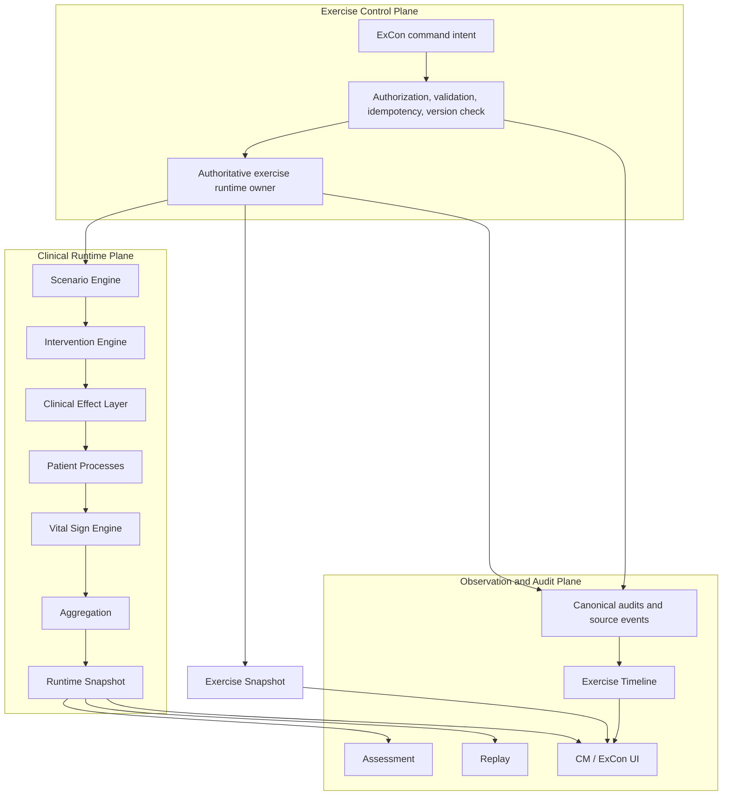
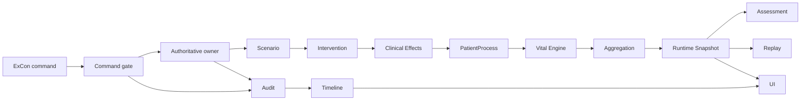

# RussiCaptor Architecture Freeze v0.7.0

**Status:** FROZEN  
**Supersedes:** `ARCHITECTURE_FREEZE_v0.6.0.md`  
**Scope:** invariant architecture rules after WP-17–WP-23  
**Purpose:** prevent clinical runtime, exercise control, synchronization, audit,
replay, and presentation responsibilities from drifting as the product expands.

This document does not replace `ARCHITECTURE.md`, implementation reports, or the
historical v0.6.0 freeze. It freezes the architecture that future work must
preserve. A work package may extend contracts inside these boundaries, but may not
silently weaken, bypass, reorder, or duplicate them.

## Table of Contents

1. [Architecture Principles](#1-architecture-principles)
2. [Architectural Planes](#2-architectural-planes)
3. [Canonical Runtime Layers](#3-canonical-runtime-layers)
4. [Layer Responsibilities](#4-layer-responsibilities)
5. [Dependency Rules](#5-dependency-rules)
6. [Forbidden Dependencies](#6-forbidden-dependencies)
7. [Clinical Effect Contract](#7-clinical-effect-contract)
8. [Contributor and Vital Sign Contract](#8-contributor-and-vital-sign-contract)
9. [Resource Allocation Contract](#9-resource-allocation-contract)
10. [Exercise Control Contract](#10-exercise-control-contract)
11. [Exercise Clock and Snapshot Contract](#11-exercise-clock-and-snapshot-contract)
12. [Command Contract](#12-command-contract)
13. [Timeline and Audit Contract](#13-timeline-and-audit-contract)
14. [Synchronization Contract](#14-synchronization-contract)
15. [Runtime Snapshot Contract](#15-runtime-snapshot-contract)
16. [Assessment Contract](#16-assessment-contract)
17. [Replay Contract](#17-replay-contract)
18. [Presentation and Workspace Contract](#18-presentation-and-workspace-contract)
19. [Configuration and Extensibility](#19-configuration-and-extensibility)
20. [Testing and Performance Contract](#20-testing-and-performance-contract)
21. [Versioning Policy](#21-versioning-policy)
22. [Architectural Decision Records](#22-architectural-decision-records)
23. [Architecture Checklist](#23-architecture-checklist)

## 1. Architecture Principles

### Single Source of Truth

Every mutable domain has one canonical owner and one writable representation.
Compatibility models and UI view models are read-only projections, never parallel
stores. In particular:

- `VitalSignState` is the canonical vital-sign truth;
- `ResourceAllocationRuntimeState` is the canonical resource-allocation truth for
  new resource-aware workflows;
- the canonical Exercise Snapshot is the exercise lifecycle, speed, simulation
  time, and control-version truth;
- canonical command audits and source events are the timeline truth.

### Deterministic Runtime

Identical configuration, canonical starting state, seed, simulation clock, and
ordered commands must produce identical state, events, snapshots, audits, and
hashes. Collection insertion order, locale, wall-clock timing, device, and network
arrival timing are not clinical inputs.

### Immutable Runtime Snapshots

Published snapshots are immutable, serializable values. Consumers cannot receive
or retain writable engine objects, mutable collections, callbacks, or lazy state.

### Replay First

Every accepted command, transition, effect, contributor, allocation decision, and
assessment result must be representable as deterministic replay input or output.
If behavior cannot be replayed and hashed, it is not canonical runtime behavior.

### Configuration Before Code

Clinical thresholds, rates, timing, priorities, mappings, efficiencies, and limits
belong in validated, versioned configuration. Disease and protocol policy may not
be hidden in generic orchestration or presentation code.

### Clinical Effects before Physiology

Interventions and medications create immutable Clinical Effects. PatientProcesses
interpret those effects and emit contributors. They do not directly assign final
monitor values.

### Separation of Simulation and Assessment

Simulation produces clinical truth. Assessment observes completed canonical data
and produces findings and debriefs. Assessment cannot change what it evaluates.

### Separation of Control and Observation

Commands may change runtime only through a validated authoritative command
boundary. Dashboards, snapshots, timelines, audits, filters, and inspectors are
observation projections and cannot become mutation channels.

### Read-only Presentation Layer

UI renders canonical projections and collects intent. It contains no physiology,
allocation, lifecycle, synchronization, timeline-source, or assessment logic.

### Data-driven Expansion

New clinical domains extend existing effects, PatientProcesses, contributors,
configurations, assessment rules, and projections. They do not introduce parallel
runtimes or new layers.

## 2. Architectural Planes

RussiCaptor has three cooperating planes. These planes separate ownership; they do
not add alternative runtime pipelines.



Rules:

- the control plane owns exercise lifecycle commands, not physiology;
- the clinical runtime plane owns simulation truth, not authorization or UI;
- the observation plane is read-only with respect to both runtime planes;
- synchronization transports canonical values between devices but is not a fourth
  authority plane.

## 3. Canonical Runtime Layers

The v0.6.0 clinical runtime order remains frozen:

```text
Scenario Engine
        ↓
Intervention Engine
        ↓
Clinical Effect Layer
        ↓
Patient Processes
        ↓
Vital Sign Engine
        ↓
Aggregation
        ↓
Runtime Snapshot
        ↓
Assessment / Replay / UI
```

Exercise control reaches runtime only through the Scenario Engine's public command
and scheduling boundary. It does not sit between clinical layers. Timeline and UI
consume snapshots and source events downstream; they are not runtime layers.

No future work package may insert another clinical runtime layer, reorder this
chain, or create a side channel around it without a new architecture milestone.

## 4. Layer Responsibilities

### Scenario Engine

Allowed: deterministic tick orchestration, scheduling, command application through
public services, and ordered execution of active PatientProcesses.  
Forbidden: disease physiology, monitor synthesis, UI, assessment, or resource
allocation policy.

### Intervention Engine

Allowed: validate interventions, resolve deterministic same-tick conflicts, request
resources, maintain intervention lifecycle, and create Clinical Effects.  
Forbidden: direct vital or patient-state writes and disease-specific physiology.

### Clinical Effect Layer

Allowed: immutable description of abstract clinical influence.  
Forbidden: Runtime mutation, monitor calculation, resource allocation, or final
physiology.

### PatientProcesses

Allowed: configuration-driven disease progression, effect interpretation, local
process state, and typed contributor emission.  
Forbidden: final monitor writes, UI dependencies, resource reservation, canonical
exercise lifecycle control, or compatibility-projection writes.

### Vital Sign Engine

Allowed: resolve accepted contributors with canonical baselines and limits; derive
vitals, trends, attribution, quality, and monitor output.  
Forbidden: disease, intervention, medication, assessment, or resource algorithms.

### Aggregation

Allowed: deterministic assembly of accepted domain output into canonical state and
snapshots after vital resolution.  
Forbidden: independent vital calculation, clinical policy, UI models, or a second
canonical store.

### Resource Allocation Runtime

Allowed: validate requirements, deterministically allocate or queue resources,
release allocations, and emit typed allocation events.  
Forbidden: clinical effectiveness decisions, vital writes, UI summaries, or
non-deterministic fairness.

### Exercise Control Runtime

Allowed: authorize and validate lifecycle/speed commands, enforce idempotency and
optimistic versioning, own the simulation clock, publish Exercise Snapshots, and
emit audit records.  
Forbidden: physiology, patient-specific treatment, assessment, UI navigation, or
multiple active clock owners.

### Assessment

Allowed: deterministic evaluation, findings, and debrief generation from canonical
snapshots and logs.  
Forbidden: writes to Runtime, patients, resources, interventions, or exercise
control.

### Timeline and Audit

Allowed: immutable normalization, deterministic ordering, filtering, grouping, and
presentation of existing canonical events and audits.  
Forbidden: inventing clinical events, changing source records, using wall-clock
time as canonical order, or becoming a command path.

### UI

Allowed: rendering read-only projections, collecting input, and dispatching typed
commands through public services.  
Forbidden: business logic, direct state mutation, resource reservation, clock
ownership, physiology, timeline-source creation, or derived vital calculations.

## 5. Dependency Rules



- Dependencies and data ownership flow in the arrow direction only.
- Downstream consumers receive immutable contracts, never runtime references.
- Commands travel upstream only through explicit public command services; they do
  not grant UI a dependency on internal engines.
- Shared models are data contracts and cannot contain hidden layer behavior.
- Compatibility adapters may project canonical data but cannot write it back.

## 6. Forbidden Dependencies

| Source | Forbidden dependency or action | Reason |
|---|---|---|
| UI | Direct Runtime, patient, resource, or exercise writes | UI is a presentation and intent client. |
| CM device | Starting or owning a restored remote exercise clock | Only the authoritative ExCon runtime advances time. |
| ExCon dashboard/inspector | Physiology or status mutation outside typed commands | Observation must remain read-only. |
| Timeline | Runtime writes or invented source events | Audit cannot change the history it displays. |
| Synchronization | Deciding command outcome or clock ownership | Transport is not authority. |
| Assessment | Runtime, resource, intervention, or exercise-control writes | Evaluation cannot affect simulation. |
| Vital Sign Engine | Disease or medication algorithms | PatientProcesses own clinical response. |
| PatientProcess | Final vitals, UI, resource allocation, or lifecycle control | Contributors and local process state are its boundary. |
| Intervention Engine | Direct physiology or final vital writes | Effects precede physiology. |
| Medication | Monitor calculations | Vital Sign Engine owns synthesis. |
| Resource allocation | Clinical benefit or disease response | Allocation manages scarcity, not physiology. |
| Replay | Mutable state, wall-clock input, or side effects | Replay must be reproducible. |
| Snapshot | Engine references, functions, promises, or lazy evaluation | Snapshots are portable canonical values. |
| Any canonical order | Locale, wall-clock time, map insertion, network arrival, or array index | Ordering must be stable across devices. |

## 7. Clinical Effect Contract

Clinical Effects are immutable, serializable, attributable, deterministic values.
They have stable identity, type, simulation timestamp, source, parameters, and
optional duration. They describe influence, not final monitor output.

Clinical Effects:

- are created only by validated clinical command/intervention/medication paths;
- never modify Runtime or snapshots directly;
- are consumed only by eligible PatientProcesses;
- are ordered deterministically and included in replay-visible data;
- use stable rejection reason codes when they cannot be applied.

## 8. Contributor and Vital Sign Contract

PatientProcesses expose physiology only as typed, immutable, serializable,
attributable contributors such as oxygenation, respiratory, circulation,
perfusion, and consciousness contributions.

- Contributors declare their operation semantics explicitly.
- Contributor outcome cannot depend on process registration or insertion order.
- PatientProcesses never write final HR, BP, RR, SpO2, EtCO2, GCS, AVPU, or
  monitor values.
- Manual override enters the same canonical vital-resolution mechanism and updates
  readings, trends, derived values, attribution, and events together.
- `VitalSignState` is the only writable vital truth.
- Legacy vital fields, where still required, are read-only projections generated
  from `VitalSignState` and cannot diverge from it.

## 9. Resource Allocation Contract

`ResourceAllocationRuntimeState` is canonical for new resource-aware workflows.
Requirements, requests, queues, allocations, releases, cancellations, and events
must be deterministic and serializable.

- Allocation is centralized; PatientProcesses and UI never reserve resources.
- Priority and fairness use stable configured rules and deterministic tie-breakers.
- Release and cancellation operations are idempotent.
- Availability, in-use, waiting, and active-patient counts are projections.
- Allocation events include stable identity, resource quantities, simulation ticks,
  actors, and typed reason codes.
- Deprecated `ResourcePool` and legacy intervention APIs are compatibility-only;
  new canonical writes may not use them.

## 10. Exercise Control Contract

The canonical exercise lifecycle is:

```text
READY → RUNNING ⇄ PAUSED → COMPLETED
```

- Only ExCon may issue authoritative lifecycle and speed commands.
- `COMPLETED` is terminal; reset and rewind require a separately specified command
  and are not implicit transitions.
- Case Manager projects lifecycle, time, and speed but cannot own or advance them.
- Allowed speeds are configuration/contract values; the current canonical set is
  ×1, ×2, and ×4.
- A control command cannot directly modify physiology or patient treatment.
- Legacy exercise-session models may remain only as read-only projections.

## 11. Exercise Clock and Snapshot Contract

There is exactly one authoritative exercise clock owner for an active exercise.

- Simulation time is canonical; wall-clock time is metadata only.
- `RUNNING` advances simulation time according to canonical speed.
- `READY`, `PAUSED`, and `COMPLETED` freeze simulation time.
- Restoring a remote snapshot never starts a clock on the receiving CM device.
- Clock ticks do not change the command concurrency version.
- Multiple-device execution may not create multiple clocks.

The canonical Exercise Snapshot contains at least schema identity, exercise ID,
lifecycle state, simulation seconds, speed, command version, and last command ID.
It is immutable, serializable, deterministic, synchronizable, replay-safe, and the
single source for all exercise status displays.

Wall-clock timestamps, transport state, UI timers, and local connection state are
excluded from canonical replay/hash input.

## 12. Command Contract

All mutating intent crosses a typed public command boundary. Before mutation the
authoritative handler performs, in deterministic order:

1. schema validation;
2. authorization and role validation;
3. exercise/patient/runtime ownership validation;
4. idempotency lookup by stable `commandId`;
5. expected-version check where applicable;
6. domain precondition validation;
7. atomic application;
8. canonical event and audit creation.

Rules:

- Repeating a processed `commandId` returns the original semantic result.
- A duplicate creates no second runtime event, audit, allocation, or mutation.
- Rejections have stable reason codes and do not partially mutate state.
- Accepted and rejected outcomes are audit-visible.
- UI-generated optimistic state is never canonical.
- Patient event injection uses the same boundary and may not bypass PatientProcess,
  contributor, aggregation, or ownership contracts.

## 13. Timeline and Audit Contract

The Exercise Timeline is a canonical read-only projection of existing source
records, including exercise-control audits, patient-command audits, and patient
timeline events.

Every canonical entry has stable identity, exercise ID, simulation time, sequence,
category, type, severity, source attribution, optional patient/issuer, display
text, and immutable metadata.

- Simulation time is the primary order.
- A documented stable source/sequence tie-breaker resolves equal simulation time.
- Wall-clock timestamps, locale comparison, array index, and network arrival order
  are never canonical tie-breakers.
- Duplicate representations of the same source command are omitted rather than
  displayed twice.
- The timeline may normalize source events but may not invent runtime or sync
  events.
- Filtering, search, grouping, and newest-first display are read-only projections.
- Restored legacy entries without simulation order retain deterministic source
  order; ISO wall time is not used to reinterpret history.
- Persisted command audits restore idempotency evidence when their canonical runtime
  event identity is available.

## 14. Synchronization Contract

Synchronization distributes canonical snapshots, commands, events, and audits. It
does not decide their meaning.

- Remote transport is not a source of runtime authority.
- Existing subscription mechanisms are reused; polling and duplicate subscription
  trees are forbidden unless a future architecture milestone explicitly approves
  them.
- Receiving clients restore immutable canonical values and create no shadow clocks
  or competing writable stores.
- Reconnect must preserve command idempotency, control version, event identity, and
  deterministic order.
- Transport metadata and arrival order are excluded from clinical and replay hash
  semantics.
- Offline or stale commands are validated against canonical owner/version state and
  rejected with stable reasons when unsafe.

## 15. Runtime Snapshot Contract

Every Runtime Snapshot is immutable, deterministic, replay-safe, fully
serializable, schema-versioned, canonically orderable, and free of mutable runtime
references. It contains one canonical representation per mutable domain.

Forbidden content includes functions, promises, iterators, callbacks, engine
instances, platform objects, writable collections, lazy evaluation, duplicate
writable vital values, or uncontrolled wall-clock/random values.

Compatibility fields are permitted only when generated automatically from the
canonical state, marked read-only, and unable to become an input to canonical
runtime decisions.

## 16. Assessment Contract

Assessment consumes canonical snapshots, logs, effects, resources, and timelines
only. It is deterministic, protocol-independent, data-driven, and replay-safe.

Assessment produces immutable results, assessment events, and debrief output. It
cannot write Runtime, modify commands, reserve resources, alter exercise state, or
feed hidden corrective behavior back into simulation.

## 17. Replay Contract

For identical configuration, fixture, seed, canonical start state, simulation
clock, and ordered commands, replay guarantees identical:

- command results and accepted/rejected audit records;
- exercise lifecycle, speed, and simulation time;
- runtime and allocation events;
- Clinical Effects and PatientProcess state/process tree;
- contributors, ownership, vitals, trends, and derived values;
- resource allocation state and queue order;
- Runtime and Exercise Snapshots;
- assessment results, debrief, and timeline content/order;
- canonical content hashes and final replay hash.

Hash input cannot depend on memory address, object identity, locale, wall-clock
time, transport metadata, network arrival, map insertion, uncontrolled randomness,
or presentation order.

## 18. Presentation and Workspace Contract

The application has two operational workspaces:

| Workspace | Responsibility | Mutation boundary |
|---|---|---|
| Case Manager | Patient-facing clinical workflow | Typed clinical commands only |
| Exercise Controller (ExCon) | Exercise overview, controls, resources, inspection, event injection, audit | Typed authoritative commands only |

Dashboard cards, inspectors, resource monitors, assessment cards, and timelines are
read-only projections. A view selector may sort, filter, group, or format canonical
values but cannot calculate clinical truth or retain a second runtime store.

The former Instructor Console term is superseded by ExCon. Stable internal
`Instructor*` contract names may remain for compatibility and do not establish a
third workspace or authority role.

## 19. Configuration and Extensibility

New PatientProcesses and clinical extensions must be configuration-driven,
validated before activation, versioned, serializable, replay-visible, and included
in canonical hash input where relevant. Magic clinical numbers are forbidden.

New clinical domains may add only necessary:

- PatientProcesses and configuration;
- typed Clinical Effects and handlers;
- typed contributors;
- assessment rules;
- resource requirements through the canonical allocator;
- commands through existing authoritative boundaries;
- tests, fixtures, adapters, and read-only projections.

They may not add a new runtime plane/layer, parallel canonical store, direct UI
mutation, alternative clock, or alternate event/timeline truth.

## 20. Testing and Performance Contract

Every future work package and pull request must preserve:

- TypeScript: PASS;
- ESLint: PASS;
- `git diff --check`: PASS;
- all applicable Golden tests: PASS;
- Runtime Hardening: PASS;
- replay determinism and canonical hash stability: PASS;
- supported-Node hash stability: PASS;
- command idempotency and deterministic audit ordering: PASS where affected;
- existing tests: no regressions.

Tests may be added. Existing tests, Golden expectations, hardening thresholds,
timeouts, equality assertions, replay hashes, and required events may not be
weakened to admit a feature.

No work package may raise timeouts, remove events, reduce replay coverage, loosen
memory or duration limits, or introduce hidden mutable caches. Performance may be
improved only by preserving observable deterministic semantics while optimizing
algorithms, data structures, serialization, cloning, and repeated computation.

Changes to a hardening limit require a separate architecture decision and a new
architecture milestone.

## 21. Versioning Policy

Architecture Freeze documents are immutable historical milestones. This freeze may
be superseded only by a new version such as v0.8.0 or v1.0 after:

1. an explicit architecture proposal;
2. impact analysis for migration, compatibility, replay, Golden tests, sync, and
   command authority;
3. new ADRs;
4. complete local and GitHub validation;
5. a new freeze document that leaves this file intact.

Feature work may clarify implementation documentation but cannot silently weaken a
frozen contract.

## 22. Architectural Decision Records

### ADR-001 — Clinical Effect Layer

Interventions and medications express immutable Clinical Effects before physiology
changes, separating treatment intent from disease response.

### ADR-002 — Contributor Model

PatientProcesses emit typed contributors instead of final monitor values, allowing
multiple processes to combine deterministically.

### ADR-003 — Assessment Is Read-only

Assessment observes completed canonical values and cannot influence the simulation
it evaluates.

### ADR-004 — Deterministic Replay

Replay equality and canonical hashing are mandatory runtime contracts for audit,
debugging, Golden validation, and cross-version confidence.

### ADR-005 — Canonical Vital Sign Aggregation

One Vital Sign Engine owns final vital synthesis from contributors; compatibility
vitals are projections rather than additional writers.

### ADR-006 — Exercise Controller Workspace Consolidation

Exercise management is presented through one ExCon workspace; legacy Instructor
contract names may remain without creating a separate workspace.

### ADR-007 — Canonical Resource Allocation Runtime

New resource-aware workflows use one deterministic allocation state and command
path; legacy ResourcePool behavior is compatibility-only.

### ADR-008 — Authoritative Exercise Control Plane

Lifecycle, speed, and simulation-time mutation belong to one authorized ExCon
runtime owner. CM and other devices project the result.

### ADR-009 — Single Exercise Clock

Only the authoritative installed runtime owner advances simulation time. Remote
snapshot restoration cannot start a second clock.

### ADR-010 — Typed Idempotent Commands

All mutation intent is validated, authorized, version-checked, and deduplicated by
stable command identity before atomic application.

### ADR-011 — Canonical Exercise Timeline

The exercise timeline is an immutable deterministic projection of canonical source
audits and events, ordered by simulation time and stable sequence rather than wall
time.

### ADR-012 — Synchronization Is Transport, Not Authority

Cloud/local synchronization carries canonical state and commands but cannot decide
runtime ownership, clock progression, ordering semantics, or command outcome.

## 23. Architecture Checklist

Every pull request must answer:

- [ ] Does this add or move a runtime mutation? Is there exactly one canonical
  owner and an existing public command/aggregation path?
- [ ] Does this add, reorder, merge, or bypass a frozen runtime layer or plane?
- [ ] Does this create a reverse dependency, callback backchannel, parallel store,
  alternate clock, or alternate timeline truth?
- [ ] Does any UI component contain physiology, assessment, allocation, lifecycle,
  synchronization, or canonical ordering logic?
- [ ] Are all commands typed, authorized, validated, idempotent, version-safe, and
  audited with stable outcomes?
- [ ] Can a duplicate command create another event, audit, allocation, or mutation?
  The required answer is **No**.
- [ ] Can a CM or restored remote client advance the exercise clock? The required
  answer is **No**.
- [ ] Is every new snapshot immutable, serializable, schema-aware, and canonical?
- [ ] Is any wall-clock, locale, insertion order, array index, or network timing
  used for canonical ordering or hashing? The required answer is **No**.
- [ ] Does a Clinical Effect, medication, intervention, or PatientProcess write
  final vitals directly? The required answer is **No**.
- [ ] Does a PatientProcess or UI allocate resources? The required answer is
  **No**.
- [ ] Does Assessment or Timeline write Runtime or invent source events? The
  required answer is **No**.
- [ ] Does synchronization decide ownership, command outcome, clock state, or event
  order? The required answer is **No**.
- [ ] Are configuration, event identity, replay, audit, and hash effects explicit?
- [ ] Were Golden expectations or hardening limits changed? If yes, is there a
  separately approved architecture/Golden milestone rather than a feature fix?
- [ ] Are TypeScript, ESLint, `git diff --check`, Golden, Runtime Hardening, replay,
  command idempotency, and supported-Node hash checks all PASS?
- [ ] Were timeouts, equality checks, hashes, required events, or coverage weakened?
  The required answer is **No**.

Any violation blocks merge until corrected or explicitly superseded by a newly
versioned Architecture Freeze.
