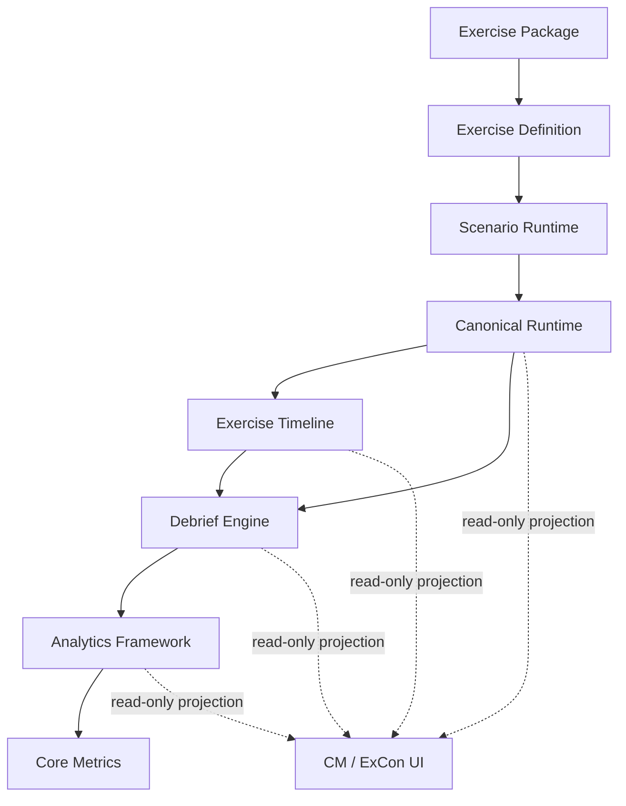

# RussiCaptor Architecture v0.7 Freeze

**Freeze version:** v0.7  
**Date:** 2026-08-04  
**Verified baseline commit:** `8341889`  
**Status:** **FROZEN**  
**Architecture review:** **READY FOR ARCHITECTURE FREEZE v0.7**

This document records the formal Architecture v0.7 milestone. The complete
invariant contracts remain defined in
[`ARCHITECTURE_FREEZE_v0.7.0.md`](./ARCHITECTURE_FREEZE_v0.7.0.md). The evidence,
resolved readiness findings, and remaining technical debt are recorded in
[`ARCHITECTURE_REVIEW_v0.7.md`](./ARCHITECTURE_REVIEW_v0.7.md).

From this milestone onward, an architectural change requires an Architecture
Decision Record (ADR) accepted before or together with the implementation. A work
package may extend the frozen architecture through its published extension
points, but may not silently replace, reorder, bypass, or duplicate them.

## Canonical architecture



The detailed clinical runtime order inside Canonical Runtime remains:

```text
Scenario Engine
        ↓
Intervention Engine
        ↓
Clinical Effect Layer
        ↓
Patient Processes
        ↓
Vital Sign Engine
        ↓
Aggregation
        ↓
Runtime Snapshot
        ↓
Assessment / Replay / UI
```

## Frozen extension points

Architecture v0.7 freezes the ownership boundaries and public extension points
for:

- Exercise Package;
- Exercise Definition;
- canonical Runtime;
- Exercise Timeline;
- Debrief Engine;
- Analytics Framework;
- Core Metrics.

New product functionality must extend the appropriate existing contract. Typical
extensions include new `PatientProcess` implementations, Clinical Effects,
contributors, `AnalyticsProvider` implementations, metric providers,
Exercise Packages, Exercise Definitions, assessment rules, and read-only UI
views.

## Frozen rules

1. No Runtime mutation is allowed outside canonical owners.
2. Dependencies point downward; new upward or circular dependencies are
   forbidden.
3. Replay determinism and all canonical hashes must be preserved.
4. Published snapshots and reports remain immutable, deterministic, serializable,
   and replay-safe.
5. New functionality extends existing interfaces instead of replacing them or
   introducing a parallel authority.
6. Runtime, Debrief Engine, Analytics Framework, and other frozen ownership
   boundaries may change only with an explicit ADR.
7. UI, Timeline, Debrief, Assessment, and Analytics remain read-only with respect
   to canonical Runtime.
8. Existing testing and performance contracts may not be weakened to accommodate
   a change.

## ADR requirement after freeze

An ADR is required whenever a proposed change would:

- introduce, remove, reorder, or merge an architectural layer;
- change a canonical owner or mutation boundary;
- create a new dependency direction;
- change snapshot, replay, hashing, or determinism contracts;
- replace a frozen public extension point;
- change the authority relationship between Package, Definition, Runtime,
  Timeline, Debrief, Analytics, or Core Metrics.

An ADR is not required for an implementation that stays inside an existing
extension point and preserves all frozen contracts.

## Verification baseline

Commit `8341889` completed the Architecture Freeze readiness work:

- the Runtime pipeline dependency cycle was removed and protected by a source
  graph regression test;
- Runtime and Exercise Snapshots were made deeply immutable;
- Exercise Package binding became the sole Package/Definition binding authority;
- TypeScript, ESLint, `git diff --check`, Golden, Runtime Hardening, replay and
  analytics hash checks passed;
- GitHub Actions passed on Node 20, 22, 24, and 26.

The annotated Git tag `architecture-v0.7` identifies the documentation commit
that formally adopts this freeze.

## Remaining technical debt

Architecture v0.7 does not claim that all technical debt has been removed. The
accepted and prioritized register is maintained in
[`ARCHITECTURE_REVIEW_v0.7.md`](./ARCHITECTURE_REVIEW_v0.7.md). Remaining items do
not invalidate the frozen architecture and must be resolved through existing
extension points or a new ADR where an architectural change is necessary.

## Freeze declaration

Architecture v0.7 is the binding architectural baseline for subsequent RussiCaptor
work. Future work packages may expand product capability, clinical coverage,
analytics, exercise content, and presentation, but architectural changes are not
accepted without a documented ADR and preservation of deterministic replay.
