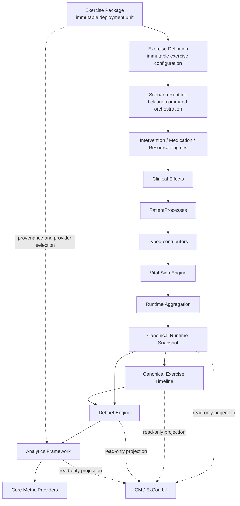

# RussiCaptor v0.7 Architecture Review & Freeze

**Review date:** 2026-08-04  
**Reviewed baseline:** `fb866df` (`main`, synchronized with `origin/main`)  
**Scope:** WP-19 through WP-28 and their interaction with the existing clinical runtime  
**Readiness update:** WP-29A completed against this review  
**Decision:** **READY FOR ARCHITECTURE FREEZE v0.7**

## 1. Executive assessment

RussiCaptor's architectural direction remains sound. The platform has a coherent
downstream flow from immutable exercise configuration through deterministic
runtime, timeline, Debrief and Analytics. The last work packages did not create a
new runtime plane, a second clinical truth, direct Analytics-to-Runtime writes, or
package-specific clinical branches. Package, Definition, Debrief and Analytics
hashing are deterministic and have cross-Node regression protection.

No critical correctness issue or need for architectural redesign was found. The
three minor alignment issues identified by the review were resolved by WP-29A
without functional changes:

1. remove one compatibility re-export import cycle in the aggregation boundary;
2. enforce the documented immutable Runtime Snapshot contract at returned-value
   level, not only by protecting the internal store with clones;
3. make Exercise Package binding the sole public binding authority so Package and
   Definition cannot be associated independently.

The architecture is therefore ready to be frozen as **Architecture v0.7**.
Subsequent product work should use the existing Package,
Definition, command, process, snapshot, Debrief and Analytics extension points
instead of adding infrastructure layers.

## 2. Review method and evidence

The review covered 343 TypeScript/TSX modules and approximately 25,811 source
lines. It included:

- static import graph traversal and cycle detection;
- forbidden-direction import searches between models, Runtime, Debrief,
  Analytics, Package and UI;
- canonical-owner and mutation-boundary tracing;
- `Date.now`, `new Date` and `Math.random` searches in canonical and legacy paths;
- immutability and clone/freeze path inspection;
- public export and compatibility API review;
- largest-file and responsibility review;
- ADR-014, ADR-015 and the complete v0.7 Architecture Freeze review;
- test-location, determinism, hash and performance-contract review.

The reviewed baseline passed 52 suites and 264 tests, including Golden,
Runtime Hardening, Package/Definition determinism and Analytics hash stability.
The GitHub Node 20/22/24/26 matrix was green for the baseline.

WP-29A readiness verification passes 53 suites and 268 tests. It adds a full
source dependency-cycle regression test, deep Runtime/Exercise Snapshot mutation
tests, single-authority Package binding tests and fixed WP-28 Package/Definition
hash expectations. Runtime Hardening, Golden, replay and Analytics hash suites
remain unchanged.

## 3. Canonical architecture

Exercise control and clinical intent enter through validated service/command
boundaries. Observation arrows never become reverse write paths.

## 4. Layer dependency matrix

| Source | Target | Rule | Current state | Assessment |
|---|---|---:|---|---|
| Exercise Package | Exercise Definition | Allowed | Package embeds one immutable definition | Clean |
| Package/Definition | Runtime | Configuration only | Authoritative runtime retains one bound Package and derives its Definition | Clean; PackageLoader is sole authority |
| Scenario Runtime | Clinical engines | Allowed downward | Orchestrates existing engines and processes | Correct but highly coupled |
| PatientProcess | Vital Sign Engine | Contributors only | Resolver adapts explicit and legacy contributors | Clean with documented compatibility adapter |
| Vital Sign Engine | Aggregation | Allowed downward | `AlignedRuntimePipeline` uses neutral aggregation core | Correct; dependency graph is acyclic |
| Runtime Snapshot | Timeline/Debrief/UI | Read-only | Consumers receive clones | No reverse writes; freeze contract is incomplete |
| Timeline | Runtime | Forbidden | No Runtime mutation import found | Clean |
| Debrief | Runtime | Read-only only | Reads snapshot types/data and never invokes mutation | Behavior clean; contract types live in service modules |
| Analytics | Debrief | Allowed | Analytics consumes immutable Debrief | Clean |
| Analytics | Runtime | Forbidden | No Runtime access found | Clean |
| Core Metrics | Analytics context | Allowed | Providers use Debrief/evidence only | Clean |
| Runtime/services | UI/components | Forbidden | No service-to-UI imports found | Clean |
| UI | Runtime/repositories | Intent/read only | UI calls public services and command handlers | No business logic found; legacy CM actions are not uniformly typed commands |
| Models | Services | Forbidden | Analytics model imports Debrief service contract | Layering debt; extract shared contracts later |

## 5. Single source of truth review

| Domain | Canonical owner | Result |
|---|---|---|
| Exercise Package | `ExercisePackageRegistry` plus PackageLoader binding | One package store and one binding authority |
| Exercise Definition | `ExerciseDefinitionRegistry` | Immutable and versioned |
| Exercise Clock | canonical snapshot and authoritative runtime owner | Single clock; legacy helpers remain explicitly deprecated |
| Runtime Snapshot | private `RuntimeSnapshotService` map | Single store; returned clones are mutable |
| Vital Sign State | `VitalSignState` via Vital Sign Engine | Canonical; legacy fields are projections |
| Exercise Timeline | deterministic `ExerciseTimelineAggregator` projection | Single canonical projection from source audits/events |
| DebriefReport | pure `reconstructDebrief` output | Immutable, replay-derived |
| AnalyticsReport | pure Analytics Engine output | Immutable and deterministically ordered |
| Core Metrics | statically registered independent providers | No score/KPI truth introduced |

There is no duplicate canonical owner causing current divergent clinical state.
The Package/Definition association is the only credible future divergence path.

## 6. Determinism and replay integrity

### Confirmed

- Package and Definition inputs are canonicalized before hashing.
- Package hash explicitly excludes its self-reference and all runtime/wall-clock
  data.
- Timeline canonical order uses simulation time, source rank, stable source order
  and ID tie-breakers.
- Debrief sorts patients naturally and hashes canonical content.
- Analytics sorts providers, metrics, diagnostics and evidence and applies a
  centralized precision policy.
- Runtime contributor and aggregation paths use stable process IDs and explicit
  priorities rather than insertion order.
- Runtime Hardening covers 10,000 ticks and cross-version workflows cover Node
  20/22/24/26.

### Bounded legacy observations

`TimelineRepository` still creates some source IDs with `Date.now()` and
`Math.random()` and patient-detail presentation sorts wall-clock timestamps.
Canonical Exercise Timeline identity and order do not use those random IDs or
wall-clock values: new records receive simulation time and sequence number, and
the aggregator creates canonical IDs from exercise/sequence. Therefore this is
not a current replay breach. It should not be copied into any new source-event
API.

Wall-clock timestamps in persistence, synchronization and operational audit are
metadata. Golden runner wall time is injectable. No uncontrolled randomness or
wall-clock dependency was found inside Package hash, Definition hash, Runtime
aggregation, replay hash, Debrief hash or Analytics hash.

## 7. Immutability review

| Artifact | Enforcement | Result |
|---|---|---|
| ExercisePackage | canonical clone, sorted collections, recursive freeze | Pass |
| ExerciseDefinition | canonical clone and recursive freeze at registry | Pass |
| Timeline Event | frozen canonical aggregation output | Pass |
| DebriefReport | recursive freeze after canonical cloning | Pass |
| AnalyticsReport / Metric Results | recursive/structural freeze and cloned evidence | Pass |
| Runtime Snapshot | internal immutable store; getters return deeply frozen detached values | Pass |

Runtime Snapshot consumers cannot mutate either the canonical stored copy or the
detached value they receive. Deep-readonly typing reflects this runtime guarantee.

## 8. Service size and responsibility review

| Location | Size | Observation | Recommendation |
|---|---:|---|---|
| `src/services/ScenarioEngine.ts` | 825 lines / 44 imports | Orchestration plus compatibility resources, interventions, airway, circulation, medication, assessment, hashing and debug publication | Do not rewrite now. Define a future bounded decomposition ADR before adding another clinical domain. |
| `src/providers/excel/WorkbookDataMapper.ts` | 677 lines | Many workbook sheets and mapping concerns | Split only during Import/Export product work, by typed sheet mapper. |
| `src/services/ModuleImportService.ts` | 546 lines | Validation, staging, persistence, rollback and reporting | Keep behavior stable; introduce internal phases when package import is connected. |
| `src/services/runtime/RuntimeAggregationCore.ts` | 377 lines | Multiple aggregation domains but cohesive canonical commit | Keep stable; split only with dedicated invariant tests. |
| `src/services/AssignmentRepository.ts` | 357 lines | Ownership lifecycle, transfers, audit and time metadata | Candidate for command/store separation after product phase begins. |
| `src/app/patient/[id].tsx` | 679 lines | Large presentation/controller surface | UI maintainability debt, not runtime architecture debt. |

No automatic split is justified by line count alone. `ScenarioEngine` is the only
service whose future growth presents a material architectural risk.

## 9. Public API and contract review

- The primary Package, Definition, Debrief, Analytics and command interfaces are
  narrow enough for current use and have dedicated tests.
- Definition binding is no longer public or independently stored; PackageLoader
  is the sole association authority.
- `ExerciseSummaryMetricProvider` is now a test-only framework fixture but remains
  exported from a production provider directory. It is not a second active Core
  Metric provider.
- Deprecated exercise session mutation helpers are referenced by legacy workflow
  tests only and are clearly annotated.
- `RuntimeAggregationPipeline` is a compatibility facade, while aligned runtime
  imports only the neutral core; public aggregation imports remain compatible.
- `Analytics.ts` imports `DebriefReport` from a service-owned model, and Debrief
  contracts import Runtime Snapshot service types. These are type-only edges but
  show that shared contracts are not fully located in the model layer.

No unused public API was proven solely from local import absence, because some
exports are valid external/test entry points. The report does not recommend bulk
export removal.

## 10. Test coverage review

Strong coverage exists for:

- Package and Definition validators, registries, hashes, binding and 100-item
  performance;
- Runtime aggregation, ownership, vitals, clinical effects and PatientProcesses;
- exercise control, clock integrity, timeline and instructor command idempotency;
- Debrief reconstruction, playback and 10,000-event performance;
- Analytics providers, failure isolation, ordering, precision, evidence, hashes
  and large input;
- Golden suites, deterministic replay and Runtime Hardening.

Gaps:

- Jest has no repository-wide coverage collection or threshold configuration, so
  coverage health is inferred from suites rather than continuously measured;
- the architecture test rejects import cycles but does not yet encode every
  forbidden layer edge from the dependency matrix;
- prerelease semantic-version ordering and legacy package safety policy are not
  covered.

These gaps justify focused cleanup tests, not a broad test rewrite.

## 11. Naming review

Canonical product terminology should be:

| Canonical term | Use | Compatibility term |
|---|---|---|
| Exercise Controller / ExCon | User-facing workspace and authority role | Instructor Console / `Instructor*` internal contracts |
| Exercise | Managed training execution | Scenario only for engine scheduling/fixture behavior |
| Exercise Package | Versioned distribution unit | Template Package only as a package classification/name |
| Exercise Definition | Immutable description of exercise behavior | Profile is one field, not a synonym |
| Metric | Factual Analytics output | KPI reserved for a later scored/thresholded layer |

There are 193 `Instructor` references, mostly stable internal command and selector
contracts. ADR-006 explicitly permits these for compatibility, so mass renaming
would add risk without product value.

## 12. ADR consistency review

ADR-014 and ADR-015 are consistent with the v0.7 planes:

- Package sits above Definition and contains configuration only;
- Definition remains immutable and versioned;
- Runtime consumes both as read-only inputs;
- Debrief and UI project them without mutation;
- Analytics package provenance is deliberately attached after canonical Analytics
  hashing, so existing hash semantics remain stable.

No ADR requires a new runtime layer. WP-29A tightened the three reviewed contracts
without superseding an ADR. The Architecture Freeze correctly
distinguishes user-visible ExCon terminology from compatible `Instructor*` names.

## 13. Technical debt register

| ID | Severity | Priority | Location | Finding | Recommended action |
|---|---|---|---|---|---|
| AR-01 | Resolved | WP-29A | Runtime aggregation boundary | Neutral `RuntimeAggregationCore` and one-way compatibility facade remove the only detected import cycle | Protected by full dependency-graph regression test. |
| AR-02 | Resolved | WP-29A | Runtime and Exercise Snapshot services | Published and returned snapshots are recursively frozen with deep-readonly public typing | Protected by top-level, nested and source-reference mutation tests. |
| AR-03 | Resolved | WP-29A | Exercise Package loader | `ExercisePackageLoader` owns the only binding map; Definition is derived from the bound Package | Idempotent same binding is allowed; conflicting binding is rejected before registration. |
| AR-04 | Medium | Near-term | Analytics/Debrief contract imports | Model layer imports service-owned Debrief contracts; Debrief imports service snapshot types | Move shared read-only contracts to `src/models` without changing serialized shapes. |
| AR-05 | Medium | Before Catalog | Package registry/validator | Home-grown semver comparison lacks complete prerelease semantics; legacy v0 is deemed safe by version alone | Add explicit compatibility adapters/policy and a standards-compliant deterministic version contract. |
| AR-06 | Medium | Before next clinical engine expansion | `ScenarioEngine.ts` | 825-line orchestration hub with 44 imports and many domains | Stop adding responsibilities; prepare a separate decomposition ADR and characterize behavior first. |
| AR-07 | Medium | Near-term | Jest/CI | No global coverage thresholds; cycle detection exists but forbidden-layer rules are not fully automated | Add reporting, narrow critical-layer thresholds and encode the remaining forbidden edges. |
| AR-08 | Low | Medium-term | Timeline repository | Legacy source IDs use wall time/randomness; canonical aggregator currently neutralizes them | Replace only when source event schema is versioned; never feed these IDs into canonical ordering/hash. |
| AR-09 | Low | Medium-term | Legacy runtime/session adapters | Deprecated ResourcePool, InterventionEngine, session mutations and vital adapter remain | Remove only after old fixtures/workbooks migrate and Golden parity is proven. |
| AR-10 | Low | Long-term | Internal APIs | `Instructor*` naming remains widespread | Keep until a deliberate breaking-contract migration; use ExCon for all new names. |
| AR-11 | Low | Before package distribution | Canonical packages | Patient data is referenced by `patientDatasetId`, not physically embedded | Define signed package payload/import format in the product phase without changing runtime layers. |
| AR-12 | Low | Opportunistic | Analytics provider directory | Framework fixture provider is production-exported but used only in tests | Relocate when touching Analytics tests; no runtime impact today. |

## 14. Strengths, weaknesses and risks

### Strengths

- explicit canonical owners and read-only observation layers;
- deterministic hashes and ordering with multi-Node verification;
- immutable Package, Definition, Timeline, Debrief and Analytics artifacts;
- strong Golden and hardening regression suite;
- provider registries and data-driven extension points;
- clear separation between factual Metrics and future KPI/scoring concerns;
- documented compatibility paths rather than silent duplicate truths.

### Weaknesses

- shared contracts are partly located under service modules;
- legacy UI/service workflows are not uniformly expressed as typed commands;
- coverage and dependency policies are not automated repository-wide.

### Risks

The largest near-term risk is adding Catalog, Authoring and Import/Export before
the remaining compatibility/version policy is explicit. The largest longer-term risk is continued growth of
`ClinicalScenarioEngine` until it becomes impossible to change one domain without
touching several others.

## 15. Freeze recommendation

**READY FOR ARCHITECTURE FREEZE v0.7**

No critical issue blocks the architectural direction, no redesign is recommended,
and AR-01 through AR-03 are resolved with unchanged Runtime Hardening, Golden,
replay, Package, Definition and Analytics hashes.

Mark the reviewed design as **Architecture v0.7 FROZEN** and begin product
engineering. Authoring, Catalog, Import/Export and Reporting must extend:

- Exercise Package and Definition registries/validators;
- existing typed command boundaries;
- PatientProcess/Clinical Effect/contributor contracts;
- canonical Timeline, Debrief and Analytics providers;
- read-only UI projections.

They must not introduce another runtime layer, alternate exercise/package store,
second clock, parallel timeline, direct Analytics/Assessment writes, or UI-owned
business logic.
