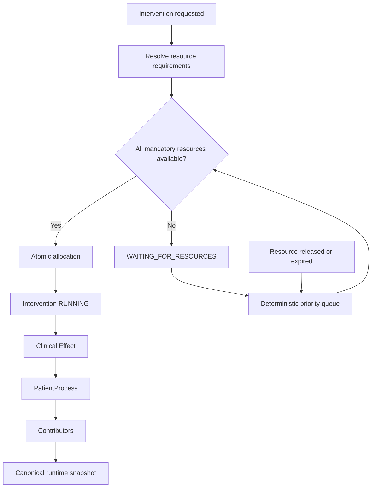

# WP-18 — Resource Allocation Engine

## Status

WP-18 introduces the canonical, deterministic allocation path for new resource-aware interventions. Existing resource UI reads this state through a projection; legacy scenarios retain their compatibility path and are not a second source of truth inside the new workflow.

## Runtime flow

`ResourceAllocationRuntimeState` is the canonical serializable state. Availability, in-use counts, waiting counts, and active patients are derived from it.

## Configuration and requirements

- Resource types and capacities are configuration-driven.
- Zero capacity is valid; negative capacity, duplicate/unknown types, and invalid timed durations are rejected.
- Requirements declare resource type, quantity, `START | DURATION | COMPLETION`, and optionality.
- Allocation is atomic across all mandatory requirements. Optional shortages never block an intervention.

The phase metadata is preserved canonically. WP-18 conservatively holds allocated requirements until the allocation's configured release condition; phase-specific partial release is intentionally not introduced.

## Priority and fairness

Waiting requests are ordered by:

1. effective priority, descending;
2. explicit priority, descending;
3. patient priority, descending;
4. request tick, ascending;
5. stable request ID.

Effective priority is configuration-driven ageing over wait time. The queue is re-evaluated only when capacity changes through release or expiry, avoiding polling and quadratic tick work.

## Release and lifecycle

- `EXPLICIT`: released by an explicit runtime command.
- `ON_INTERVENTION_END`: released when the intervention completes or is cancelled.
- `TIMED`: expires deterministically at its configured tick.
- Repeated release and cancellation calls are idempotent.

Lifecycle states distinguish requests, waiting, allocation, running, completion, cancellation, and failure. Waiting interventions cannot emit clinical effects.

## Replay and observability

IDs, event order, queue order, snapshots, and hashes depend only on canonical simulation input. Snapshot restore preserves allocation state, queue state, events, sequence, and tick. Events include patient, intervention, request/allocation identity, resource quantities, request/allocation/release ticks, and typed reasons.

The existing Resource Monitor displays a read-only projection from canonical allocation state when available. It contains no reservation or prioritisation logic.

The former `ResourcePool` and `InterventionEngine` remain deprecated compatibility APIs for pre-WP-18 scenarios. They are not used by the resource-aware intervention runtime and must not be used for new canonical writes.

## Performance

Normal requests scan configured requirements and active allocations. Queue sorting occurs only on capacity release/expiry. No per-tick deep clone, polling loop, or random/time-dependent operation was added.

## Deferred scope

Resource transfer between active patients is deliberately deferred. It requires an explicit two-sided atomic transfer contract and is not simulated as release-plus-request in WP-18.
